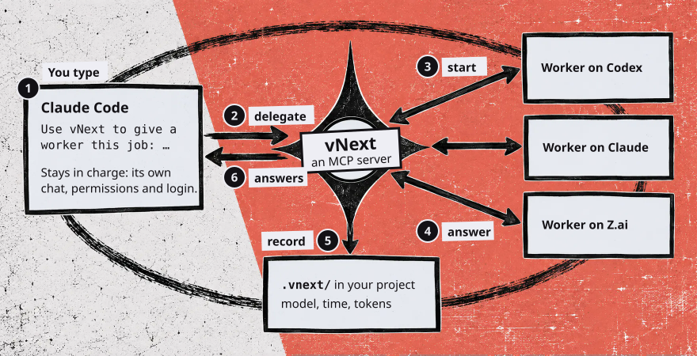

# vNext

[](https://github.com/RazAndAlex/vnext-workforce/actions/workflows/ci.yml)
[](LICENSE)

[](docs/vnext-0.3.0.mp4)

vNext lets Claude Code hand work to other AI agents, called workers. Each
worker runs on the model you choose, in your project, and several can run at
the same time. vNext keeps a record of every worker: the model, the time, the
tokens and what it reported.

You talk to Claude Code as usual. It stays in charge, with its own chat,
permissions and login. It decides what each worker does and checks what comes
back.

## One job, start to finish

You type this in Claude Code:

```
Use vNext to give a worker this job: read README.md and list every
command it tells a user to run. Tell me when it is done.
```



1. Claude Code calls `delegate`. The reply shows the limits of the chosen
   worker. It also warns you when the job does not fit those limits, for
   example a time budget longer than one turn or a job that needs a browser.
2. vNext starts the worker. Workers run on OpenAI Codex with your own login.
   They also run on Z.ai or Command Code with an API key. See [Models](#models).
3. When the worker stops, vNext wakes Claude Code with the worker's report.
   Claude Code does not have to wait. The wake also works for a worker that
   Claude Code retries or replaces.
4. Claude Code reads the report and acts on it. It can read the whole record,
   send the worker a message, steer it, retry it, replace it, approve its
   request or stop it.
5. The record stays in your project. It shows which worker ran, on which model,
   for how long and with how many tokens. See [Where the records go](#records).

Claude work stays with Claude Code's own subagents. See
[Why vNext has no Claude workers](#no-claude).

`vnext-mcp --check` lists the models that you can reach. A failed worker has
its own page: [When a worker fails](#failures). vNext also tells you when a
newer Codex CLI or Claude Agent SDK is out. See
[Keeping up with new models](#new-models).

## What you need

- An Apple-silicon Mac or a 64-bit Windows PC. We run the automatic tests on
  GitHub's Windows machines. Nobody has used vNext on a real Windows PC yet.
- Python 3.11 or later, [uv](https://docs.astral.sh/uv/getting-started/installation/)
  and Claude Code.
- A login or an API key for at least one provider.
- About 660 MB of disk space. The install downloads about 200 MiB, most of it
  the Codex CLI and the Claude Agent SDK.
- Node.js is optional. With Node, Claude Code can restart vNext without a
  restart of its own. See [Disk space and Node.js](#node).

## Install

1. Install the command:

   ```
   uv tool install "vnext-workforce[claude] @ git+https://github.com/RazAndAlex/vnext-workforce"
   ```

2. Put the uv tool folder on your PATH. You do this one time:

   ```
   uv tool update-shell
   ```

   uv adds its folder to your shell startup file and prints the name of that
   file. On a Mac with zsh, the file is `~/.zshenv`.
3. Open a new terminal and run `vnext-mcp --help`. If you see a usage message,
   the install is correct.
4. Add the plugin to Claude Code:

   ```
   claude plugin marketplace add RazAndAlex/vnext-workforce
   claude plugin install vnext@vnext
   ```

5. Quit Claude Code fully and open it again. On a Mac, use Cmd-Q. On Windows,
   close every window. Claude Code reads PATH only when it starts.

## Check that it works

In Claude Code, type `/mcp`. The list shows `vnext` with 14 tools when the
restart proxy starts. Then run this in a terminal:

```
vnext-mcp --check
```

The check lists the models that your logins and keys give you. If the server
cannot start, the check tells you why. See
[If the server does not start](#troubleshooting).

## Reference

<a name="models"></a>
<details>
<summary><b>Models</b></summary>

vNext offers each model that your own logins and keys can reach. When a
provider has no login or key, its models do not appear. To see the list on
your machine, run `vnext-mcp --check`.

Codex workers need `codex login`, and they use your usual Codex login folder.
That is `~/.codex`, or the folder that `CODEX_HOME` names when Claude Code
starts. Z.ai and Command Code workers need an [API key](#api-keys).

<a name="no-claude"></a>
**Why vNext has no Claude workers.** Anthropic does not let other products run
Claude on your Pro or Max login. The rule is on the
[Agent SDK page](https://code.claude.com/docs/en/agent-sdk/overview). Claude
Code is the manager, and it runs on your own login. When a job needs Claude,
Claude Code gives it to one of its own subagents.

</details>

<a name="api-keys"></a>
<details>
<summary><b>API keys for Z.ai and Command Code</b></summary>

The keys go in `~/.vnext/providers.json`. Nothing makes the folder for you. On
a Mac, run:

```
mkdir -p ~/.vnext
```

On Windows, run this in PowerShell:

```
New-Item -ItemType Directory -Force "$HOME\.vnext"
```

On Windows the file is `%USERPROFILE%\.vnext\providers.json`.

Then write the file. Keep only the providers you use:

```json
{
  "providers": {
    "zai": {"api_key": "your Z.ai key"},
    "commandcode": {"api_key": "your Command Code key"}
  }
}
```

The file holds your keys. On a Mac, make it readable by you alone:

```
chmod 600 ~/.vnext/providers.json
```

</details>

<a name="troubleshooting"></a>
<details>
<summary><b>If the server does not start</b></summary>

13 tools means the restart proxy did not start. Then Node or npm is missing,
the download failed, or `VNEXT_RELOAD=0` turned it off. vNext works without
it.

If `/mcp` shows `CONNECTION_CLOSED`, the server stopped. Claude Code hides the
reason, and `vnext-mcp --check` prints it. Give the check the same
`--catalog <path to a catalog JSON file>` flag your server starts with, if it
starts with one. The check knows only the flags you give it. Two causes are
usual:

- **The terminal cannot find `vnext-mcp`.** Run `uv tool update-shell`, then
  quit Claude Code fully and open it again.
- **No provider has a login or a key.** Run `codex login`, or add an
  [API key](#api-keys).

</details>

<a name="node"></a>
<details>
<summary><b>Disk space and Node.js</b></summary>

The Codex CLI is about 114 MiB of the download and the Claude Agent SDK about
88 MiB. The `claude` extra in the install command adds the Claude Agent SDK.
Z.ai workers need it.

With Node.js, a small helper called the restart proxy lets Claude Code restart
the vNext server without a restart of its own. The first start downloads the
helper from npm, so it needs a network connection. The helper keeps about
25 MB under `~/.cache/vnext/reload`.

</details>

<a name="new-models"></a>
<details>
<summary><b>Keeping up with new models</b></summary>

A new model usually comes with a new release of the Codex CLI or of the Claude
Agent SDK. Once a day, vNext asks PyPI for the newest stable release of each.
It automatically installs newer versions into a fresh folder under
`~/.vnext/runtimes/`, about 560 MB, and verifies both programs and their model
lists without sending a prompt. Running workers keep using their current pair.
`vnext-mcp --check` and `inspect` report when an update is ready, which pair
switched at startup, or why an update failed.

A verified update applies at the next server start. Nothing restarts the
server automatically. A restart stops running workers, so restart when none
are running. A new Codex model that vNext has not run yet shows as "not tested
by vNext". A failed update keeps the current runtime. Promotion also checks
that the new runtime covers the catalog this server will load; an incompatible
pair stays staged and the current pair runs.

Automatic attempts are limited to once per pair per day, even if an install is
interrupted. Failed builds are removed. After a promotion, unreferenced runtime
folders older than 14 days are removed; active, previous and staged pairs and
the pinned bundle are retained.

To install a pair explicitly, or choose versions with `--codex-version` and
`--sdk-version`, run:

```
vnext-mcp --update-runtimes
```

An explicit update replaces staging, preserves the current pair for rollback,
and clears automatic-update notices.

To restore the previous pair (or the versions shipped with vNext when there
was no side runtime), run:

```
vnext-mcp --update-runtimes --rollback
```

Rollback keeps installed folders and declines that pair for automatic updates.
Set `VNEXT_AUTO_UPDATE=0` for daily notices and manual installation only.
Set `VNEXT_NO_UPDATE_CHECK=1` to disable daily checks and automatic installation.
Set `VNEXT_RUNTIMES_DIR` to keep new versions in another folder.

</details>

<details>
<summary><b>Updating vNext</b></summary>

Run the install command again with `--force`:

```
uv tool install --force "vnext-workforce[claude] @ git+https://github.com/RazAndAlex/vnext-workforce"
```

Then refresh the skill with `claude plugin uninstall vnext@vnext` and
`claude plugin install vnext@vnext`. `claude plugin update` leaves the old skill
in place while the plugin keeps the same version number.

</details>

<a name="failures"></a>
<details>
<summary><b>When a worker fails</b></summary>

```
vnext-report "<path to your project>"
```

The report lists each session in the project. Under a failed session it shows
the error and the last lines the provider wrote. Add `--full` for the whole
traceback, or `--failures` to see only the workspaces with a failure. Either
form exits non-zero when it finds a failure or a record it could not read.
With no path, it reads the folder you are in.

A worker's turn has 30 minutes. vNext stops a Z.ai turn that runs
past that. A Codex or Command Code turn goes on while the worker keeps working.
vNext stops it once 30 minutes pass with nothing from it. Either way, what the
worker wrote stays in your project, and `retry` continues the same session.

</details>

<a name="records"></a>
<details>
<summary><b>Where the records go</b></summary>

vNext writes its records into your project, under `.vnext/`, and tells Git to
ignore them.

- `runs/<session>.jsonl` has every event of a session.
- `status/<session>.json` shows who is working now.
- `outcomes/<session>.jsonl` has one row for each finished worker: the outcome
  text it reported, the model you asked for, the exact model that answered,
  its effort, its duration and its token counts.

</details>

## More

- [plugins/vnext/README.md](plugins/vnext/README.md) is the full reference: the
  record files, the server over HTTP, your own model list, and what the proxy
  reports to Claude Code.
- To run the tests from a clone: `uv run --group dev pytest -q`. The first run
  makes a `.venv` folder of about 320 MB.
- [SECURITY.md](SECURITY.md) tells you how to report a security problem.
